# Location Sound Studios

**A field recording goes in. A thumbnail and a full-length video come out — and the skyline
you see is drawn from the recording's own loudness.**

Quiet stretches make short buildings. A siren, a shout, a passing train makes a tower. The
result is a picture of the recording that is *specific to that recording*, generated in about
a second, instead of a stock background with text on it.

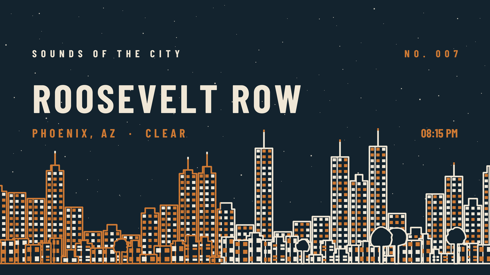

That orange-to-bone split is the **playhead**. In the video it slides left to right over the
full runtime, so the skyline fills in as the recording plays and the clock in the corner
advances from the real start time. The picture is a progress bar that also happens to be the
artwork.

<sub>Python 3 · Windows desktop (Tkinter) + CLI · ffmpeg · ~9,000 lines across 8 modules · numpy and Pillow are the only third-party runtime dependencies</sub>

---

## Why it exists

I record ambient city and nature soundscapes and publish them as long-form video. Every upload
needs a thumbnail and a video, they have to look like they belong to the same series, and
hand-making them in an image editor is both slow and inconsistent.

So the artwork is derived instead of drawn. The same audio always produces the same picture
(all randomness is seeded from a hash of the loudness envelope), the branding comes from a
user-editable preset file, and a two-hour recording renders without ever loading the audio
into memory.

It is a real tool with real users — it ships at **v1.12.1**, updates itself from this
repository on launch, and is what publishes the series.

---

## What it makes

### Seven silhouettes from one recording

Same audio, same seed, same loudness envelope — only the shape changes. Geometry is built
**once** in 1280×720 design units and scaled at draw time, so the thumbnail, both video layers
and a 4K frame are one shape at different sizes rather than separate derivations.

| | | |
|:---:|:---:|:---:|
| 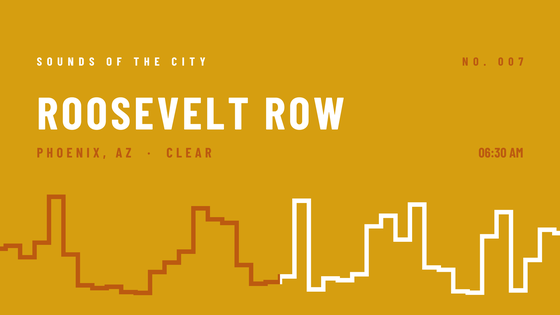 | 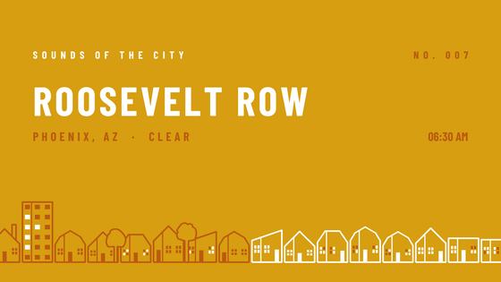 | 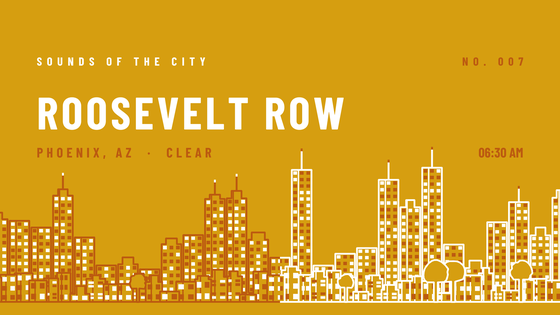 |
| `blocks` | `houses` | `city` |
| 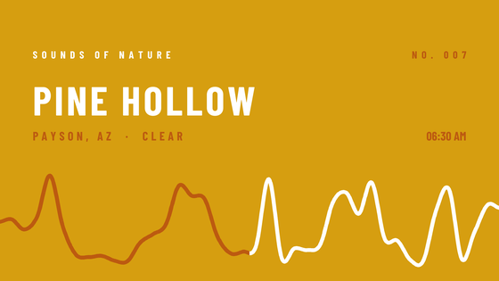 | 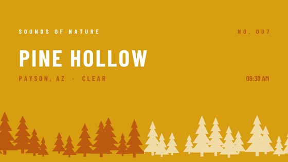 | 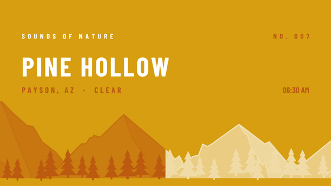 |
| `topo` | `forest` | `mountains_forest` |

### Eight palettes, and exactly three colours

A frame has a `background`, a `foreground` and an `accent`. Nothing else. Weather, stars and
scrims all derive their tones from those three at a target contrast ratio rather than
introducing a fourth colour, which is why a palette can be swapped without anything needing
hand-tuning.

| | | | |
|:---:|:---:|:---:|:---:|
| 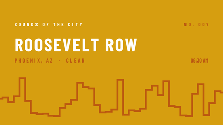 | 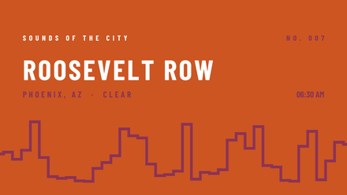 | 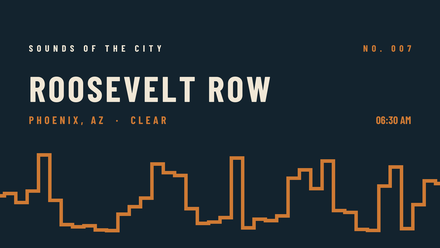 | 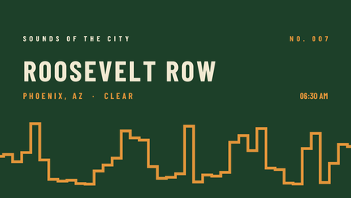 |
| Morning | Evening | Night | Canopy |
| 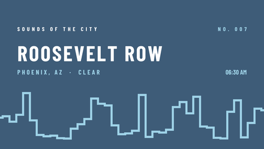 | 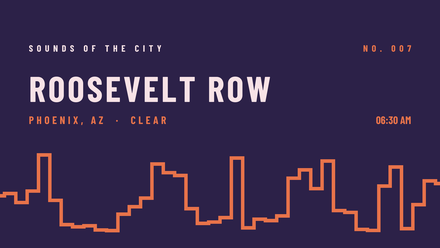 | 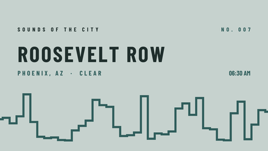 | 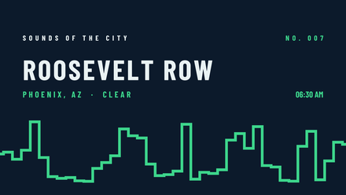 |
| Alpine | Alpenglow | Mist | Aurora |

### Weather, on any style, for free

Clouds sit in whatever sky the silhouette leaves free; rain falls in front of it. Both are
drawn once and held, so they cost the video nothing to encode. Their colour is bisected out of
the palette's own sky and foreground at a target contrast ratio — which is why the clouds
*darken* on the one light-skied palette, with no special case written for it.

| | |
|:---:|:---:|
| 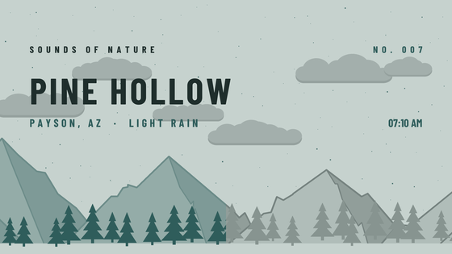 | 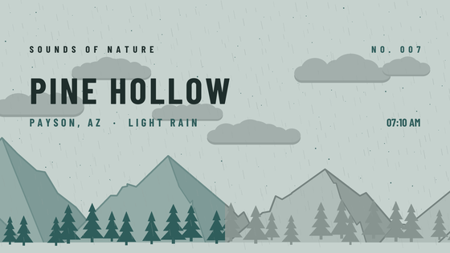 |
| `--weather clouds` | `--weather rain` |

### Or your own photographs and footage

The same slate composites onto a supplied photo or video clip, with a contrast check that
samples across the runtime rather than trusting a single frame.

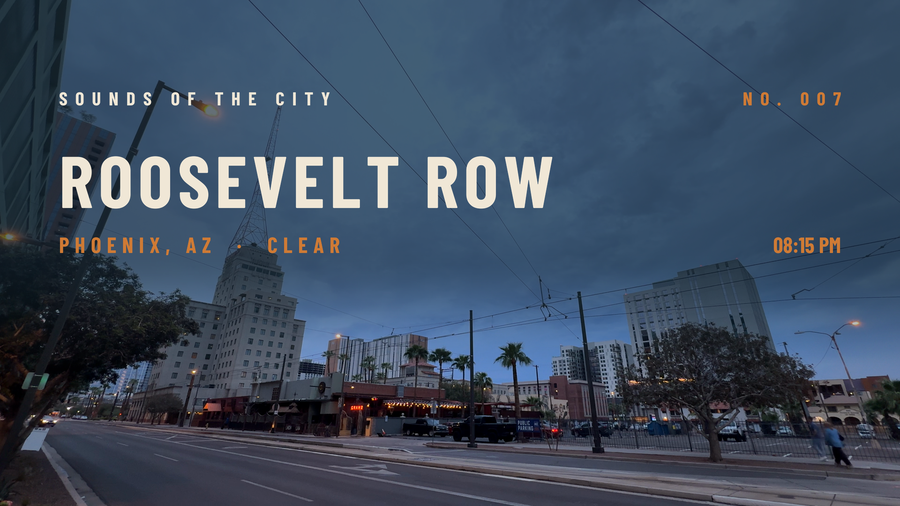

### The desktop app

A Tkinter form over the render engine — six tabs matching the CLI's own argument groups, a
background render thread, and a log that streams progress back to the window.

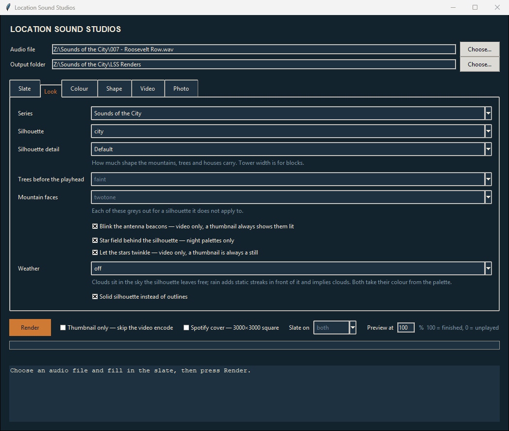

---

## How it works

```
audio file
   |  ffmpeg -> raw PCM, streamed in 1 MB chunks         envelope()
windowed RMS in dBFS                                     never fully in RAM
   |  reduce to N buildings, map to a drawable range     to_levels()
loudness levels
   |  median/MAD outlier detection snaps building        find_standouts()
   |  edges onto unusually loud moments                  block_edges()
   |  seeded geometry in 1280x720 design units           lss_scene.build()
one shape, any size
   |  compose() - the SAME function for the thumbnail
   |  and for every video frame
   |  ffmpeg filter_complex: a bone layer, a clay layer,
   |  and a mask that slides across over the runtime     build_video()
thumbnail.png + video.mp4 + a JSON sidecar of every parameter used
```

Two details do most of the work:

**The video is the thumbnail.** `compose()` is a single frame-composition function. The video
is that same layout rendered larger, with the timestamp slot left blank for ffmpeg's `drawtext`
to fill in live. There is no second implementation to drift out of sync.

**The playhead is a mask, not a render.** Rather than drawing thousands of frames, it builds
one "unplayed" frame, one "played" frame, and slides a mask between them in the filter graph.
The apparent animation costs two composites total.

---

## Engineering notes

The parts I would actually want to talk about in an interview. Every number below is measured
on this machine, not estimated — the repo carries a benchmark harness
(`tools/encode_bench.py`) and a byte-for-byte regression checker (`tools/identity_check.py`,
213 cases) because on a generative renderer "it still looks fine" is not evidence.

**Resizing a premultiplied RGBA image is a trap.** Compositing the slate onto a photo, the
obvious implementation — premultiply, hand Pillow one RGBA image, resize — produces bright
fringes on glyph edges, because LANCZOS' negative lobes push colour above alpha and the
composite overshoots. Downsampling coverage as an `L` image and colour as an `RGB` image
*separately* fixes it. Measured mean absolute error against the opaque reference path over a
flat sky: **0.15 levels** done separately, against **3.3–4.6 with peaks past 250** for the
single-image version.

**The obvious optimisation was the wrong one, twice.** The shipping encode uses a keyframe
every ten seconds, which is nearly free on flat vector frames. On a held *photograph* it costs
18× the bytes: 180s at 2560×1440 measured **27.3s / 57.6 MB** with `-g 100` against
**14.5s / 3.1 MB** with one keyframe. But that finding does not transfer back to moving
footage, where a held frame's logic inverts — so clip mode deliberately does *not* inherit
photo mode's encode settings.

**Blending has to happen in RGB.** Compositing the slate in `yuv420` measures error peaks of
81 levels on the accent-coloured text, because the chroma plane is half resolution exactly
where the glyph edges are.

**Looping a clip under a long recording, cheaply.** A 17.6-minute clip under a 159.9-minute
recording becomes **12 concat entries from 4 encoder passes and 2 stream copies** — 21.6
minutes of footage encoded for a 159.9-minute output. The body is encoded once and every bare
repeat names that same file; bare stretches inside a partly-slated repeat are stream-copied
out of it. That only works because the cut points are computed *before* the body is encoded
and handed to x264 as `-force_key_frames`. The awkward case is real and handled rather than
refused: when the final truncated repeat is shorter than the outro, the slate straddles a loop
seam — two source ranges, one appearance, and it must not fade at the join.

**Failing loudly beats falling back quietly.** `lss_scene.check()` and `lss_photo.check()` run
up front and reject an impossible combination of flags as an error. Photo mode refuses every
silhouette and loudness flag rather than ignoring it. A silent fallback in a batch renderer
means finding out an hour later that sixty files are wrong.

---

## Project layout

```
lss_studio/
  lss_render.py     render engine + CLI entry point - envelope, levels, compose, encode
  lss_scene.py      generative silhouette geometry, seeded and resolution-independent
  lss_draw.py       drawing primitives, the slate, contrast derivation
  lss_photo.py      photo-background mode: normalisation, validation, segment planning
  lss_presets.py    series/theme/colour resolution - the only place colours are settled
  lss_presets.json  user-editable presets; the updater never overwrites this
  lss_studio.py     the Tkinter window - a thin form over lss_render.run()
  lss_update.py     self-update: version check, download, py_compile verify, swap, restart
tools/              development scripts - benchmarks and the identity checker, not shipped
docs/MANUAL.md      the full user manual
```

---

## Try it

```bash
# one-time: installs ffmpeg via winget, plus numpy and pillow
Setup.bat

# the GUI
"Location Sound Studios.bat"

# or the CLI - same engine, every flag
py lss_studio/lss_render.py recording.wav \
   --place "Roosevelt Row" --city "Phoenix, AZ" --conditions "Clear" \
   --date 2026-09-12 --start "08:15 PM" --style city --colors Night --thumb-only

py lss_studio/lss_render.py --list-presets
```

`--thumb-only` skips the video encode and renders a still in about a second, which is how
every image on this page was made.

**[Full user manual →](docs/MANUAL.md)** · [Release process](RELEASING.md) · [Development scripts](tools/README.md)
